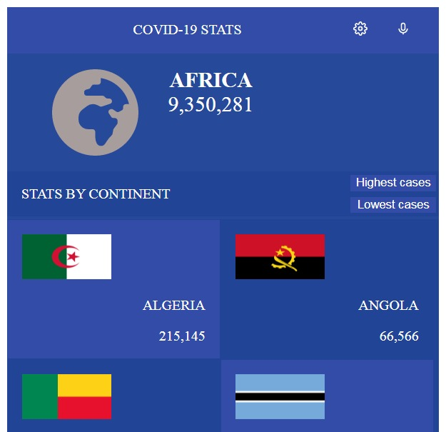
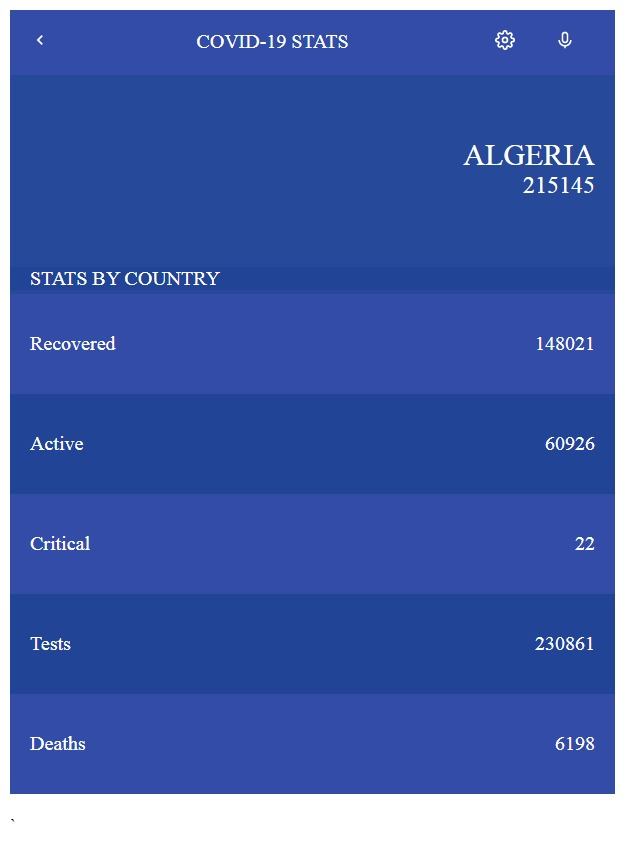

# Metrics webapp
> This is the React capstone project at Microverse Program where I am working with data from diseases API, this app will allow users to view the COVID-19 cases in countries in Europe.

## Built With

- HTML5
- CSS3
- JavaScript(ES6)
- React
- React Router
- Redux
- npm
- diseases API  (https://disease.sh/)

## Live Demo
- [Live Demo](https://angry-borg-c6fc5f.netlify.app/)

## Video Link

- [Video Link](https://drive.google.com/file/d/16wc568N9VZYNf3OdTY__uGTyeUs9UM0V/view?usp=sharing)

## Getting Started
 - Get the repository into your PC.
  Clone this repository using this URL https://github.com/mbdesigns1989/React-capstone-webapp or download it as a ZIP from the "Code" tab and extract the files.

 - Usage
  Once you get the repository on your PC. Navigate to it by running cd React-capstone-webapp/.
  Make sure to checkout to the desired branch running git checkout {BRANCH_NAME} on your terminal.

  Run `npm install` on the terminal to install the project dependencies.
  Run `npm run start` to see the web app running in your browser.

### To get a local copy, run the following steps:

- [Copy this link](https://github.com/mbdesigns1989/React-capstone-webapp)
- go to the directory that you want to clone the repository in.
right-click and choose Git Bash here.
type "git clone "https://github.com/mbdesigns1989/React-capstone-webapp".
run `npm install` and then `npm start`  `npm run test`.

## Author

- Mohamed Badr
- GitHub: (https://github.com/mbdesigns1989)
- Twitter: (https://twitter.com/mohamed66083152)
- LinkedIn: (https://www.linkedin.com/in/mohamed-badr-mb/)

##  Contributing

Contributions, issues, and feature requests are welcome!

Feel free to check the [issues page](../../issues/).

## Show your support.

 Original design idea by [Nelson Sakwa on Behance](https://www.behance.net/sakwadesignstudio)

## Acknowledgments

